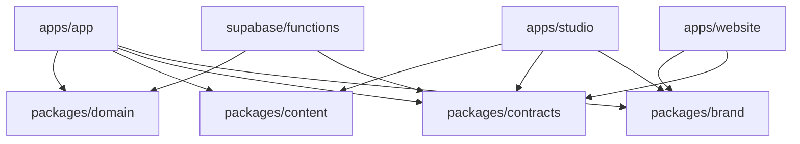

# Golden monorepo boundaries and migration sequence

**Status:** accepted Wayfinder decision for [Choose the monorepo boundaries and
migration sequence](https://github.com/kayan-mudita/golden-house-beta/issues/3),
locked by Kayan on 2026-09-13. The live private beta remains the current Vite
build until the replacement passes the stated gates.

## Decision

Golden becomes one npm-workspace monorepo. The canonical product App is one Expo
Router codebase for iOS, Android, and installable web. The Website and Golden
Studio are separate web applications. Supabase owns backend migrations and Edge
Functions. Small packages carry product rules, contracts, approved content
bundles, and brand tokens without importing deployment or UI concerns.

Use a strangler migration. Keep `https://golden-house-beta.netlify.app/` on the
current tested Vite beta while the Expo App is built and verified on an isolated
Netlify preview/site. Do not make the current URL serve a half-migrated shell.
After App, Website, backend, offline, accessibility, and deep-link gates pass,
switch the web entry point once and keep a tested rollback deploy available.

## Final repository shape

```text
golden/
├── apps/
│   ├── app/                 # Expo Router: iOS, Android, installable web
│   ├── website/             # public marketing Website; no product iframe
│   └── studio/              # private Golden Studio web application
├── packages/
│   ├── domain/              # pure Golden rules and state transitions
│   ├── content/             # schemas + generated approved/offline bundles
│   ├── contracts/           # API/event schemas and generated Supabase types
│   ├── brand/               # colors, type, spacing, motion, icons, assets
│   └── test-fixtures/       # synthetic fixtures; never production manuscripts
├── supabase/
│   ├── migrations/          # reviewed relational schema, RLS, functions
│   ├── functions/           # Guide, Stripe, notifications, moderation jobs
│   ├── seed/                # local-only synthetic and preview data
│   └── tests/               # RLS, webhook, deletion, and lifecycle checks
├── legacy/
│   └── vite-beta/           # temporary rollback/reference after extraction
├── docs/
└── package.json             # npm workspaces and repository-wide commands
```

The migration starts with the current Vite app at the repository root. It moves
to `legacy/vite-beta` only after workspace scripts and the existing Netlify build
have been proven from the new location. The directory is deleted after cutover,
the rollback window, and source-equivalence checks. Git history remains the
long-term record; production code must not import from `legacy/`.

## Dependency law



- `packages/domain` contains no React, React Native, browser, Supabase, Stripe,
  Expo, or Node runtime imports. It owns invariants such as one showed-up day per
  local calendar date, two-door limits, entitlement evaluation inputs, Table
  limits, and operation-level merge functions.
- `packages/content` separates manuscript source, immutable Lesson Revisions,
  release evidence, and generated client bundles. Preview manuscripts remain
  clearly marked; only publishable revisions enter production bundles.
- `packages/contracts` owns versioned request, response, webhook-normalization,
  sync-operation, and deep-link schemas. Apps consume contracts; they do not
  import Edge Function implementations.
- `packages/brand` is the implementation boundary for the accepted Golden visual
  system. The App uses React Native components near its routes; Website and
  Studio may use web components, but all consume the same tokens and approved
  assets. This avoids pretending DOM and React Native components are identical.
- No app imports another app. No client package contains service-role, Stripe,
  AI-provider, email-provider, or push-provider secrets.

## App routes

Expo Router owns stable canonical routes from the start:

```text
/(public)/welcome
/(public)/door/[door]
/(app)/today
/(app)/lesson/[door]/[revision]
/(app)/together
/(app)/guide
/(app)/events
/(app)/account
/(app)/plans
/gift/[claim]
/auth/callback
```

The web export generates finite lesson-route parameters from the release catalog
and gives unknown/stale revisions an explicit unavailable state. Website links,
notifications, gift claims, auth callbacks, iOS Universal Links, and Android App
Links resolve these same HTTPS paths. Route choice does not grant access; loaders
still enforce Member, Entitlement, invitation, and content-release rules.

## Deployment boundaries

| Surface | Build | Runtime/data | Migration rule |
|---|---|---|---|
| Current beta | Existing root Vite build, later `legacy/vite-beta` | Existing Netlify Functions/Blobs | Keep current URL and rollback deploy intact until replacement gates pass. |
| App web | `apps/app` Expo static export + manifest + Workbox `injectManifest` | Supabase through public RLS-protected APIs; no service secrets | Use an isolated preview/site before cutover. Never embed it back into the Website iframe. |
| Native App | Same `apps/app` routes through EAS development/release builds | Native SQLite outbox, SecureStore, Supabase | Store submissions wait for physical-device, policy, privacy, and content gates. |
| Website | `apps/website` static web build | Public release catalog and canonical links | Reproduce the supplied Website, replace iframe launch with HTTPS App routes, then deploy independently. |
| Golden Studio | `apps/studio` authenticated web build | Supabase RLS plus server-only privileged functions | Never share public App roles or bundle unpublished content into public clients. |
| Backend | `supabase/` migrations and Edge Functions | Postgres, Auth, Storage, Realtime, Cron | Local/staging first; production changes require reviewed migrations and rollback notes. |

The existing Netlify state and Guide handlers remain beta-only adapters until the
corresponding Supabase functions are live-tested. New product features must not
extend the whole-snapshot/last-write-wins state API.

## Ordered migration

### 0. Pin the beta

Record the current Git SHA, Netlify site identity, build command, environment
names, smoke journeys, encrypted-state proof, and rollback deploy. Add a visible
build identifier to non-production builds. A workspace change cannot proceed if
the current beta build or its tests stop working.

### 1. Create the workspace without moving production

Add npm workspaces and repository-wide `dev`, `build`, `test`, `typecheck`, and
targeted app commands. Create empty `apps/app`, `apps/website`, `apps/studio`,
`packages/*`, and `supabase/` boundaries. Bring the accepted Expo visual proof
into `apps/app` by rewriting it as production components; do not merge the
throwaway prototype wholesale. The root Vite deployment remains unchanged.

### 2. Extract contracts before screens

Move the normalized catalog and deterministic rules into `packages/content` and
`packages/domain` behind compatibility exports. Run the original Vite app against
those packages and prove its existing 42-test baseline plus rendered journeys.
Create `packages/brand` from measured supplied tokens and assets. This establishes
shared truth before two UIs can drift.

### 3. Land the Supabase foundation

After [Define the Supabase product model and security boundaries](https://github.com/kayan-mudita/golden-house-beta/issues/4)
resolves, add migrations, RLS, synthetic seeds, generated types, and isolated
local/staging verification. Build the operation API and provider-event boundary;
do not copy encrypted whole snapshots into the final model.

### 4. Port complete vertical journeys

Port behavior in dependency order, completing data, UI, offline, error, privacy,
and accessibility states for each slice before starting the next:

1. Guest onboarding, door choice, Today, lesson, practice, earned word, and local
   offline progress.
2. Member identity, Guest transfer, recovery, device/session management, sync,
   export, and deletion.
3. Table invitations, membership, consented Practice Signals, Suns, and voice
   notes.
4. Guide retrieval/source display and Golden Studio revision-to-publication flow.
5. Plans, checkout, Entitlements, Gift Claims, billing lifecycle, and refunds
   after the iOS commerce decision.
6. Practice Reminders and Golden Hour Night discovery/RSVP/moderation.

Each slice uses real Supabase staging data plus synthetic fixtures for failure
states. A screen backed only by local mock arrays is not complete.

### 5. Separate and connect the Website

Move the supplied Website into `apps/website`, preserve its visual source, and
replace the iframe/modal dependency with canonical HTTPS links into installed
native App or web App fallback. Verify every door CTA, sign-in callback, Gift
Claim, lesson share, event, and plan journey with and without an installed app.

### 6. Prove release candidates

Run repository builds and isolated tests, RLS/provider-event tests, two-device
offline convergence, install/update/offline PWA checks, physical iOS/Android
journeys, accessibility matrix, direct nested-route refreshes, and Website links.
Verify backend requests, entitlements, push/email receipts, and deletions from
observed staging/production-like results rather than configured state.

### 7. Cut over once

Freeze writes briefly if state transformation requires it, migrate eligible beta
records with counts and reconciliation, deploy App web and Website, verify exact
build identities and critical journeys, then switch the current web entry point.
Retain the previous Netlify deploy and documented rollback trigger. Remove the
Vite service worker before the Expo Workbox worker takes control, and verify old
caches do not strand clients. Retire `legacy/vite-beta` only after the rollback
window and data reconciliation close.

## Gates

The cutover is blocked until all of these are true:

- The supplied visual system passes owner review on Today, lesson, Together,
  Guide, account, plans, Gift Claim, event, and error/empty/offline states.
- iOS, Android, and installed web complete the same core practice journey and
  preserve progress across restart, update, offline work, and later sync.
- Website canonical links work for installed-app, warm-app, cold-app, signed-out,
  and browser-fallback cases.
- Supabase RLS and privileged-function tests prove Member, Table, Studio, content,
  event, and Entitlement boundaries; deletion and export complete end to end.
- Stripe/Google/Apple commerce behavior follows the final iOS decision, and
  Entitlements come only from verified, replay-safe provider events.
- No unapproved lesson, proposed voice, unsigned media, sample count, sample
  event, or preview price is represented as released or connected.
- The new web service worker updates cleanly and does not cache Guide, auth,
  private state, or other sensitive API responses.
- The live release has a tested rollback deploy, migration reconciliation, build
  identity, operator runbook, and support path.

## Locked cutover rule

Kayan accepted this rule on 2026-09-13: **keep the current Netlify private-beta
URL on the existing Vite build until the Expo App and separate Website pass the
full cross-platform gate, then switch once with a tested rollback deploy.**
